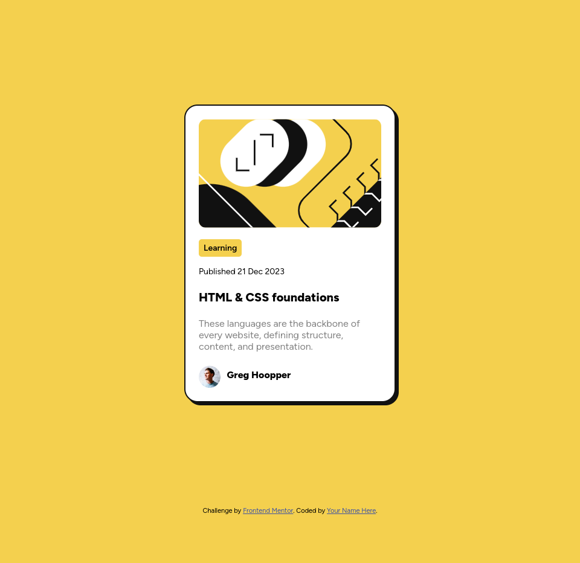

# Frontend Mentor - Blog preview card solution

This is a solution to the [Blog preview card challenge on Frontend Mentor](https://www.frontendmentor.io/challenges/blog-preview-card-ckPaj01IcS). Frontend Mentor challenges help you improve your coding skills by building realistic projects.

## Table of contents

- [Overview](#overview)
  - [The challenge](#the-challenge)
  - [Screenshot](#screenshot)
- [My process](#my-process)
  - [Built with](#built-with)
  - [What I learned](#what-i-learned)
  - [Useful resources](#useful-resources)
- [Author](#author)

## Overview

### The challenge

Users should be able to:

- See hover and focus states for all interactive elements on the page

### Screenshot

### Links

- Solution URL: [Github repo](https://your-solution-url.com)
- Live Site URL: [Live site URL](https://your-live-site-url.com)

## My process

### Built with

- HTML5
- CSS - Flexbox

### What I learned

This project helped me to practice my knowledge of CSS flexbox. I also Learned how to use variable fonts in my project.

### Useful resources

- [Variable Fonts on the Web Using CSS](https://www.digitalocean.com/community/tutorials/css-variable-fonts) - This article provides useful examples for using variable fonts in your projects.

## Author

- Website - [Ankit Barla](https://barla-x88.github.io/portfolio/)
- Frontend Mentor - [@barla-x88](https://www.frontendmentor.io/profile/barla-x88)
- Twitter - [@BarlaX88](https://twitter.com/BarlaX88)
